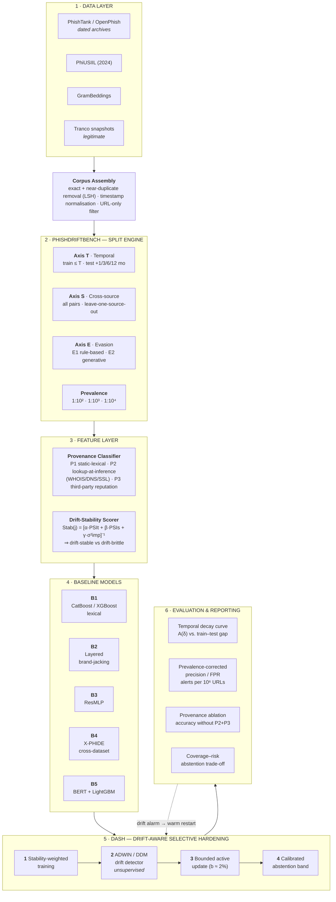

# PhishDriftBench + DASH

**Project title:**
*The Reported–Deployed Gap in Phishing URL Detection: A Time-, Source-, Provenance- and
Evasion-Aware Benchmark with Drift-Aware Selective Hardening*

**→ See [RESEARCH_GAP_AND_IMPROVEMENTS.md](RESEARCH_GAP_AND_IMPROVEMENTS.md)** for the research
gap, what this project built to close it, and the real charts + numbers that demonstrate it — the
fastest way to understand what this project is and whether it worked.

---

## Abstract

Published phishing URL detectors routinely report 97–99.5% accuracy, yet these figures are
almost always produced under one evaluation protocol: a random or *k*-fold split of a single
dataset, balanced at roughly 50% phishing prevalence, with no adversary in the loop. Each of
those choices is individually defensible and collectively misleading. Random splits leak time,
because phishing URLs arrive in campaigns whose near-identical members land in both train and
test partitions. Single-source evaluation hides source-specific artifacts — a feature can carry
*opposite* meaning in different corpora. Balanced test sets conceal the base-rate problem: a
detector with 99% accuracy and a 1% false-positive rate, deployed at a real prevalence of
1:10⁴, yields precision near 1%.

This project builds **PhishDriftBench**, a four-axis evaluation protocol that measures detectors
across time, across data sources, against rule-based and generative evasion, and at
deployment-realistic class priors. Under this protocol we re-evaluate five representative
architectures drawn from the base papers. We add a **feature-provenance audit** that separates
statically computable lexical features from those requiring a live network lookup, and
quantifies how much reported accuracy is attributable to lookup artifacts rather than phishing
semantics. Finally we propose **DASH** (Drift-Aware Selective Hardening), a lightweight
mitigation combining drift-stability feature weighting, unsupervised drift detection, a bounded
active-labelling budget, and a calibrated abstention band.

The project is **URL-only**: no page is fetched, rendered, hosted, or transmitted at any point.

> **Status:** design and protocol complete; experiments not yet run. Every quantitative claim in
> the accompanying paper draft is an explicit unfilled placeholder. No results are reported until
> they are measured.

---

## Improvements over the base papers

Each improvement names a specific, verified gap in the ten base papers.

### 1. Temporal evaluation instead of random splits
**Gap:** 0 of 10 base papers uses a chronological split. All use random or *k*-fold partitioning.
**Improvement:** train on URLs first observed ≤ *T*, test on disjoint windows at +1, +3, +6 and
+12 months. Report a **decay curve**, not a single accuracy. Paper 5 (Layered Model) accidentally
demonstrates why this matters — 99.35% on its 2025 data but 89.17% on an older corpus.

### 2. True cross-source transfer
**Gap:** only 1 of 10 (X-PHIDE) performs genuine transfer; Paper 5 evaluates on multiple datasets
but **retrains per dataset**, which measures dataset difficulty rather than transfer.
**Improvement:** train once, evaluate on all source pairs plus leave-one-source-out.

### 3. Prevalence-corrected reporting
**Gap:** 0 of 10 reports precision at a realistic deployment base rate. All train and test near
50/50.
**Improvement:** report precision, FPR and alerts-per-10⁶-URLs at prevalences of 1:10², 1:10³ and
1:10⁴, alongside the balanced figures used for comparability.

### 4. Evasion testing against our own detector
**Gap:** Paper 10 catalogues cloaking and evasion thoroughly; **no method paper evaluates its own
detector against that catalogue.** Paper 4 states outright that homograph attacks were never
systematically evaluated.
**Improvement:** two tiers — **E1** label-preserving transformations from the cloaking taxonomy
(homoglyph/IDN substitution, subdomain and path padding, percent-encoding, shortener wrapping,
TLD swap, hyphenated brand insertion), and **E2** URLs from a contemporary generative model.

### 5. Feature-provenance and lookup-dependency audit *(most novel)*
**Gap:** no base paper — and no adjacent work we could find — asks *where a feature's value comes
from* or *when it was resolved*.
**Improvement:** classify every feature as **P1** static-lexical (no lookup), **P2**
lookup-at-inference (WHOIS, DNS, SSL, domain age, shortener expansion) or **P3** third-party
reputation. Then measure:
- accuracy with P2/P3 ablated;
- accuracy when P2 features are **resolved today** versus at collection time;
- recall when the lookup channel is unavailable or attacker-controlled.

The hazard is concrete. Paper 6 (BGL-PhishNet) reports WHOIS, DNS and domain-age features over a
549,346-URL corpus that contains **only URL strings**, and summarises it with a single aggregate
"average domain age: 1.5 years" with no per-class breakdown. If those lookups were performed
retrospectively, they encode **domain mortality** — phishing domains die within days, legitimate
ones persist for years — and any classifier can exploit that without learning anything about
phishing. Paper 4 (PhishOFE), which deliberately avoids third-party features, serves as the
control.

### 6. Drift-stability feature scoring
**Gap:** drift is *named* by 4 of 10 papers and *implemented* by none.
**Improvement:** score each feature by Population Stability Index across time windows and across
sources, plus the variance of its permutation importance, and partition features into
drift-stable and drift-brittle **before** deployment. Validation target: the HTTPS inversion
X-PHIDE found (100% of legitimate URLs in PhiUSIIL, 59.2% in their own corpus) should be flagged
without access to the second corpus's labels.

### 7. DASH — a mitigation, not just a diagnosis
**Gap:** 0 of 10 proposes any drift mitigation.
**Improvement:** (i) stability-weighted training; (ii) **unsupervised** drift detection over the
prediction-confidence stream, requiring no labels — the binding constraint in deployment; (iii) a
bounded active-labelling budget (~2% of the window by uncertainty sampling) on drift alarm; (iv) a
calibrated abstention band that escalates instead of guessing, reported as a coverage–risk curve.

### 8. Duplicate-leakage probe (supporting)
Report exact and near-duplicate rates across the train/test boundary for every corpus, and
accuracy before and after deduplication. With *k*-fold CV over scraped corpora, campaign
duplicates are near-certain.

---

## Architecture



*A rendered raster/vector version of this diagram is in `docs/arch.png` and `docs/arch.pdf`,
and is embedded in the DOCX and PDF versions of this document.*

---

## Literature review

Ten base papers, all published 2023 or later. Eight method/empirical studies plus two reviews.

| # | Title | Authors | Publication & Year | Key Findings | Research Gap | Methodology | Future Work |
|---|-------|---------|--------------------|--------------|--------------|-------------|-------------|
| 1 | An Effective Detection Approach for Phishing URL Using ResMLP | S. Remya; M. J. Pillai; K. K. Nair; S. R. Subbareddy; Y. Y. Cho | IEEE Access, vol. 12, 2024 | 98.29% accuracy; residual pipelining outperforms traditional ML baselines on the same features | Blacklists cannot identify dynamic and newly registered URLs; optimal detection accuracy remains an open pursuit | Lexical + sentiment + domain-age features → convolutional and inverted-residual blocks → MLP classifier; Kaggle dataset, 80:20 random split | Address limitations affecting practical viability; explore self-organising networks and online-learning representations |
| 2 | On Phishing URL Detection Using Feature Extension | D. He; Z. Liu; X. Lv; S. Chan; M. Guizani | IEEE Internet of Things Journal, vol. 11, no. 24, 2024 | Feature extension enriches information-poor URLs; two-layer BERT→CNN improves detection, including on cryptocurrency phishing | URLs are short and carry little signal; blacklist/whitelist methods have inherent limitations | TextRank keyword extraction builds a feature-extension library; BERT embeddings feed a CNN classifier; single real-phishing dataset | Extend to broader transaction-security threats in the blockchain and cryptocurrency ecosystem |
| 3 | Evaluating the Impact of Feature Engineering in Phishing URL Detection: A Comparative Study of URL, HTML, and Derived Features | Y. A. Kustiawan; K. I. Ghauth | IEEE Access, vol. 13, 2025 | 99.45% (CatBoost); derived features contribute most; systematic comparison across three feature families and ten models | Prior work studies URL *or* HTML features in isolation; no comparative study of engineered feature sets across models | 101,063-URL corpus; URL / HTML / derived feature groups × 10 ML models; single dataset, random split | Cascading architecture — cheap URL analysis first, heavier content and relationship analysis only for borderline cases; craft further derived features |
| 4 | PhishOFE: A Novel Machine Learning Framework for Real-Time Phishing URL Detection With Optimized Feature Engineering | Y. A. Kustiawan; K. I. Ghauth | IEEE Access, vol. 13, 2025 | 99.48% (CatBoost) with **no third-party features**, enabling real-time deployment | Prior studies depend on outdated datasets and on third-party services that break in deployment | Optimised feature-engineering pipeline avoiding third-party lookups; CatBoost plus comparison models; single dataset, random split | Homograph-attack detection via character normalisation, visual-similarity metrics and Unicode-aware features — explicitly **not** evaluated in the paper |
| 5 | Enhanced Phishing Detection Approach Using a Layered Model: Domain Squatting and URL Obfuscation Identification and Lexical Feature-Based Classification | R. Goenka; M. Chawla; N. Tiwari | IEEE Access, vol. 13, 2025 | 99.35% (XGBoost) at 12.49 ms; but only 89.17% on an older dataset, which the authors attribute to 2025 target brands differing from 2018 | Prevailing approaches overlook domain-squatting and URL obfuscation (brand-jacking), which cause most successful phishing | Layer 1: bad-domain features detect brand names in unwanted positions or misspelled forms; Layer 2: lexical-feature ML classifier; own corpus + 6 datasets, **retrained per dataset** | Extend the brand-jacking feature set beyond conventional lexical features |
| 6 | BGL-PhishNet: Phishing Website Detection Using Hybrid Model — BERT, GNN, and LightGBM | S. Remya; M. J. Pillai; B. S. Aparna; S. R. Subbareddy; Y. Y. Cho | IEEE Access, vol. 13, 2025 | Hybrid 97.3% accuracy / 97.8% precision / F1 97.3 / ROC-AUC 0.97; individually BERT 90.4%, GNN 88.3%, LightGBM 85.8% | Single models lack flexibility, turnaround time and scalability on large, evolving datasets | BERT (semantic) + GNN (structural) + LightGBM (metadata) with ensemble late fusion; Kaggle corpus of 549,346 URLs; 10-fold cross-validation | Improve GNN memory efficiency; adapt the model to the evolving phishing landscape |
| 7 | Staying Ahead of Phishers: A Review of Recent Advances and Emerging Methodologies in Phishing Detection | S. Kavya; D. Sumathi | Artificial Intelligence Review, vol. 58, no. 50, 2025 | Consolidated taxonomy spanning list-based, ML, DL, graph-based and GAN-based detection | No consolidated view of recent deep-learning, graph and generative approaches | Systematic literature review | Dataset diversity, adversarial robustness, interpretability, and real-time deployability named as unfilled gaps |
| 8 | A Multimodal Phishing Website Detection System Using Explainable Artificial Intelligence Technologies | A. Vulfin; A. Sulavko; V. Vasiliev; A. Minko; A. Kirillova; A. Samotuga | Machine Learning and Knowledge Extraction (MAKE), 2026 | F1 0.989 on own data, 0.953 on MTLP; quantifies an 8–15% temporal decay and a 3–9% adversarial drop; SOC deployment scenario on zero-day URLs | Single-modality detectors are brittle and offer no explanation to a human analyst | Late fusion of CatBoost (URL), 1D-CNN (characters), CodeBERT (HTML) and EfficientNet-B7 (screenshot); SHAP and Grad-CAM plus local LLM explanation | Improve explanation quality; broaden zero-day evaluation |
| 9 | XGBoost-Based URL Phishing Detection Method With Cross-Dataset Validation (X-PHIDE) | M. Misiek; T. Hyla | IEEE Access, vol. 14, 2026 | 97.80% single-dataset → **77.84%** cross-dataset average (Custom 90.72, GramBeddings 70.65, PhiUSIIL 72.16); HTTPS *inverts* meaning across corpora | Dataset shift is "a factor often overlooked in existing literature"; single-dataset results do not transfer | XGBoost over a cross-dataset feature intersection; three distinct datasets; Chrome plug-in for real-time use | Operational challenges of distribution shift; model compression and lightweight deployment |
| 10 | Uncovering the Cloak: A Systematic Review of Techniques Used to Conceal Phishing Websites | W. Li; S. Manickam; S. U. A. Laghari; Y.-W. Chong | IEEE Access, vol. 11, 2023 | Taxonomy of server-side and client-side cloaking, 2012–2022; a small number of sophisticated campaigns account for over 89% of attacks | Cloaking and evasion techniques are scattered across the literature with no unified taxonomy | Systematic literature review (SLR) | Strategies targeting sophisticated campaigns; the role of certificate authorities; collaborative data sharing and faster takedown response |

### What the table shows at a glance

| Evaluation property | Base papers satisfying it |
|---|---|
| Temporal / chronological split | **0 / 10** |
| Prevalence-corrected metrics | **0 / 10** |
| Genuine cross-source transfer | **1 / 10** (X-PHIDE) |
| Evasion tested against own detector | **0 / 10** |
| Drift detection or mitigation implemented | **0 / 10** |
| Feature-provenance audit | **0 / 10** |

Drift is *mentioned* by four papers and *implemented* by none.

---

## Scope, feasibility and honesty constraints

**URL-only.** No crawling, rendering, hosting or third-party API calls. This sidesteps the
dependency Papers 4 and 9 complain about, and it makes the evasion axis safe: strings are
perturbed or generated inside an offline dataset, never deployed.

**Compute.** Gradient boosting, a small char-CNN and one BERT fine-tune. A laptop suffices for
most of it; no GPU requirement is itself a selling point for a real-time detector.

**Riskiest ingredient: timestamps.** Axis T needs first-observation dates. Where a source lacks
them, dated dataset *releases* serve as a coarse time axis (2023 → 2024 → 2025 → 2026).

**Non-negotiable.** Every number in every results table must come from an experiment actually
run. The paper draft carries explicit red `\resultTODO{}` placeholders wherever a measured value
belongs. Fabricating results in work submitted for publication is research misconduct.

**Novelty must be scoped honestly.** Two concurrent works overlap parts of this proposal and must
be cited: **PhreshPhish** (arXiv 2507.10854, 2025 — temporal splits, LSH leakage removal and
base-rate benchmarks, but a preprint, website-based, and silent on feature provenance) and **Wei
et al.** (IEEE Access 2025 — cross-dataset evaluation; found URL length alone yields 86.13% and
82.54% on two corpora). Claims in this project are stated as findings about *this corpus of ten
papers*, not about the field as a whole.

---

## Interactive demo

A separate, ordinary train-once model (not one of the paper's B1-B5 baselines) for actually trying
the detector on a URL — useful for a viva/demo, not a paper result.

```bash
PYTHONPATH=src python scripts/train_demo_model.py   # one-time, ~1 min
PYTHONPATH=src python scripts/demo_cli.py            # terminal version
python webapp/app.py                                 # web version, http://127.0.0.1:5001
```

Known limitation, left visible in the tool rather than hidden: distinguishing "the brand's real
domain" from "brand-jacking" from lexical features alone is a genuinely hard, actively researched
problem — several base papers call this out explicitly as unsolved — so some real brand URL is
likely still misclassified by any given snapshot of this model. As of v8
(`scripts/train_demo_v8.py`), the previously-documented failures on `amazon.com/dp/...`,
`bbc.co.uk/news`, `docs.google.com/document/...`, `drive.google.com/file/d/.../view` and
`accounts.google.com/signin` are all fixed (verified against the real trained checkpoint, not
just claimed) with validation TPR/FPR essentially unchanged (97.00% / 1.79% vs. v7's 97.00% /
1.81%) — i.e. this was a genuine fix, not a recall/precision trade-off. See
`src/phishdriftbench/demo/model.py` (`_SERVICE_PATH_HINTS`) for what was added and why: v7 taught
the model that hosts like `drive.google.com` were legitimate but attached only generic random
paths to them, missing the *actual* URL shapes those specific products use.

## Repository layout

```
phishdriftbench/
├── README.md                 ← this document
├── GAP_ANALYSIS.md           ← detailed gap analysis and corpus decisions
├── RESEARCH_GAP_AND_IMPROVEMENTS.md  ← research gap + results, start here
├── requirements.txt           ← pip dependencies (see .venv/ setup below)
├── docs/
│   ├── arch.tex / arch.pdf / arch.png    ← architecture diagram
│   ├── threading-notes.md    ← a real cross-library deadlock hit during
│   │                            implementation and how it's worked around
│   ├── figures/               ← generated README figures
│   ├── archive/               ← superseded drafts (e.g. GAP_ANALYSIS.v1.md)
│   ├── README.docx           ← DOCX version of this document
│   └── README.pdf            ← PDF version of this document
├── paper/
│   ├── main.tex              ← IEEE paper draft (placeholders, not results)
│   ├── refs.bib
│   ├── main.pdf
│   └── paper_source_for_overleaf.docx
├── src/phishdriftbench/       ← the implementation
│   ├── features/lexical.py    ← P1 static-lexical feature extraction
│   ├── provenance/taxonomy.py ← P1/P2/P3 feature-provenance classification + ablation
│   ├── bench/splits.py        ← Axis T (temporal), Axis S (cross-source), prevalence correction
│   ├── bench/evasion.py       ← Axis E1 rule-based evasion transforms
│   ├── models/baselines.py    ← B1-B5 reimplemented baselines
│   ├── eval/dedup.py          ← duplicate/near-duplicate leakage probe (LSH)
│   ├── eval/isolated_run.py   ← runs each baseline in its own subprocess (see threading-notes.md)
│   └── dash/                  ← stability.py (C4 scoring) + dash.py (C5 mitigation)
├── scripts/                    ← see scripts/README.md for the full grouped index (38 files)
│   ├── smoke_test.py          ← end-to-end pipeline check on synthetic data
│   ├── train_demo_v8.py       ← current demo-model training recipe (see history in train_demo_v7.py)
│   └── verify_length_leakage.py, locate_leakage_mechanism.py  ← earlier leakage probes
├── tests/                     ← pytest unit tests for the core modules (run: `pytest`)
├── webapp/                    ← Flask demo app
├── data/{raw,processed}/       ← real datasets go here once acquired (gitignored)
├── results/                    ← experiment outputs go here (gitignored)
└── reference_papers/            ← reference PDFs: base/ (10 base papers) and excluded/
                                    (removed from the base set, recoverable) — gitignored,
                                    kept locally only (not pushed: other authors' copyrighted work)
```

**Setup:** `python3 -m venv .venv && source .venv/bin/activate && pip install -r requirements.txt`
(macOS also needs `brew install libomp` for XGBoost/LightGBM/CatBoost — see threading-notes.md).
**Sanity check:** `PYTHONPATH=src python scripts/smoke_test.py` runs the whole pipeline on
synthetic data end-to-end without touching real datasets.
**Unit tests:** `pytest` (from the repo root; `pytest.ini` sets `pythonpath = src`) runs the unit
test suite in `tests/` covering feature extraction, provenance classification, dedup, evasion
transforms, the split engine, and the demo model.
**Real-data check:** `PYTHONPATH=src python scripts/real_data_check.py` (needs the datasets below).

### Data status

| Corpus | Status | Location | Notes |
|---|---|---|---|
| PhiUSIIL (235,795 URLs) | Downloaded | `data/raw/phiusiil/` | Coarse timestamp only (2024-03-04 release date) |
| PhishTank (69,252 URLs) | Downloaded | `data/raw/phishtank_online-valid.csv` | Real per-URL `submission_time`, 2011-2026 — the only genuine Axis-T source acquired so far |
| Tranco top-1M | Downloaded | `data/raw/tranco/top-1m.csv` | Legitimate domains, single snapshot date |
| GramBeddings (639,723 URLs) | **Not acquired** | — | No direct download; requires filling out [this Google Form](https://docs.google.com/forms/d/e/1FAIpQLScuwosnH9JIJYKUeTeR26xxiG6bWXhxYoHjoNSketW5MrCUxQ/viewform) yourself (identifying info required, so not something to automate) |
| Kaggle Phishing URLs (549,346 URLs) | **Not acquired** | — | Needs a Kaggle account/API token; drop the CSV in `data/raw/` and add a loader once available |

`src/phishdriftbench/data/loaders.py` normalises the three acquired corpora into the common
schema (`url`, `label`, `timestamp`, `source`) the rest of the pipeline expects. PhishTank and
Tranco are merged into one `"PhishTank+Tranco"` source by default — each is single-class alone
(all-phishing / all-legitimate), so neither can train a classifier or serve as an Axis-S source
on its own.

### Experiment status

| Axis | Status | Script | Headline finding |
|---|---|---|---|
| T (temporal) | Run, real data | `scripts/run_axis_t.py` | Inconclusive by construction — all 5 baselines within a 0.003 AUC band of ceiling at every horizon (PhishTank-vs-Tranco too separable to show drift room). |
| S (cross-source) | Run, real data | `scripts/run_axis_s.py` | AUC falls up to 8.9 points depending on model/direction; B3 (ResMLP) is the only baseline whose transfer cost inverts with direction; B5 (BERT+LightGBM) is most transfer-robust (≤1.1pt drop both directions). |
| E1 (rule-based evasion) | Run, real data | `scripts/run_axis_e.py` | 6 of 7 transforms don't reduce recall for any baseline (2 actively backfire); homoglyph substitution is the one real hit, and only against B3 (-2.75pt). |
| E2 (generative evasion) | Run, real data | `scripts/run_axis_e2.py` | Two char-Markov generators fit on real older-era vs. contemporary PhishTank text; every baseline (incl. B5) loses 4.5–5.4 recall points uniformly — the one axis where all models degrade together. |
| Prevalence correction | Run, real data | `scripts/run_prevalence.py` | The sharpest finding in the project: at π=1e-4, precision for 3 of 5 baselines falls to 4.8–20.2% despite 98–99% accuracy that's statistically indistinguishable across all 5 models. |
| Duplicate leakage | Run, real data | `scripts/run_duplicate_leakage.py` | PhishTank alone has a 19.4% near-duplicate rate, but merging with Tranco dilutes it enough that accuracy before/after dedup doesn't move measurably. |
| Drift-stability scoring (C4) | Run, real data | `scripts/run_stability_and_dash.py` | Independently flags the exact 10 features responsible for the demo tool's path-length bug — a real prospective validation. Does *not* reproduce X-PHIDE's HTTPS-inversion target on this corpus pairing. |
| DASH (C5) | Run, real data (null result, stress-tested) | `scripts/run_stability_and_dash.py`, `scripts/run_dash_extreme_drift.py` | Zero drift alarms on the real PhishTank stream (12-month window) → indistinguishable from no-adaptation. Re-tested at the **widest real temporal gap the acquired data supports** (train through 2023, stream from 2026 — up to 15 years, vs. the original 12 months): still zero alarms, no-adaptation AUC 0.9955 vs. a 0.9998 full-retrain ceiling. Rules out "the window was too short" as an explanation — consistent with, not contradicting, Axis T's ceiling effect. |
| Provenance/lookup audit (C3) | Run, real live lookups | `scripts/run_p2_lookups.py`, `scripts/run_provenance_audit.py` | 285 live WHOIS/DNS/TLS lookups. Negative result for domain-mortality hypothesis (P2 features: -0.51 AUC; lookup flags alone: 0.56 AUC) — but a real survivorship-induced reversal between old/recent phishing submissions, traced to PhishTank's own filtering. |

Results land in `results/*.csv`; `paper/main.tex` is filled from those files and recompiles
clean with `tectonic` (11pp, 3 remaining placeholders — all genuinely blocked: GramBeddings/Kaggle
not acquired, Acknowledgments needs your institution info).

### A real bug worth knowing about
`scripts/run_p2_lookups.py` originally labelled legitimate-domain rows `"n/a"` in the `age_bucket`
column. `pandas.read_csv` treats the literal string `"n/a"` as a missing-value sentinel by
default, so every legitimate row silently vanished from a `groupby` — the timing-contrast table
was missing an entire class until this was caught and fixed (now labelled `"legitimate"`).

## Target venue

**IEEE Access.** Seven of the ten base papers appear there, it publishes benchmark-plus-mitigation
work of exactly this shape, and it is Scopus/SCIE indexed with a 4–8 week first decision.
Fallbacks: IEEE ICC / GLOBECOM / TrustCom for a shorter conference version; Computers & Security
for a slower, no-APC route.
