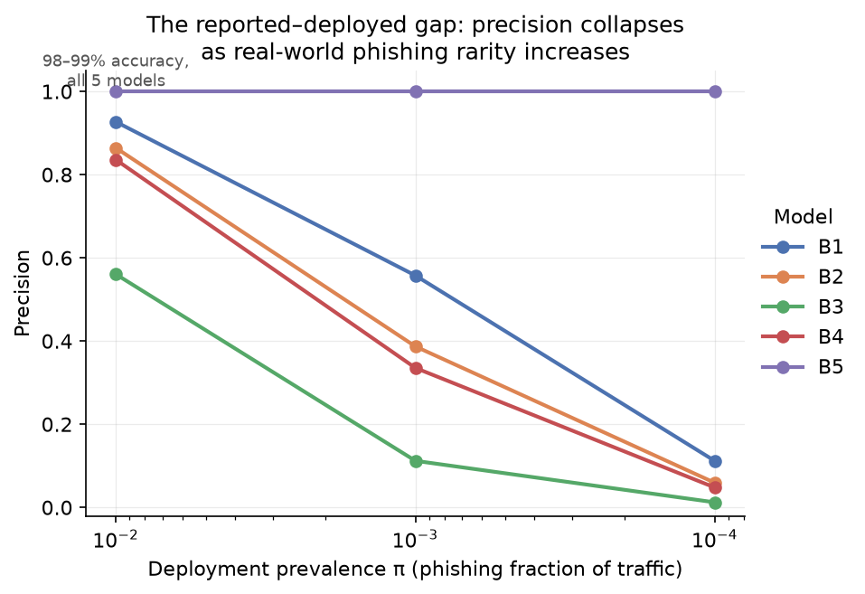
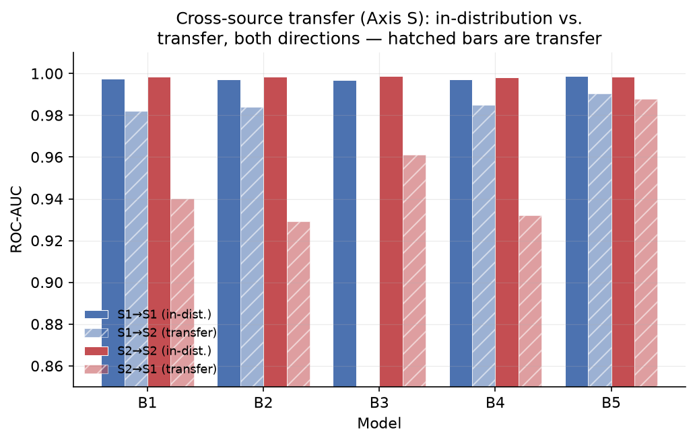
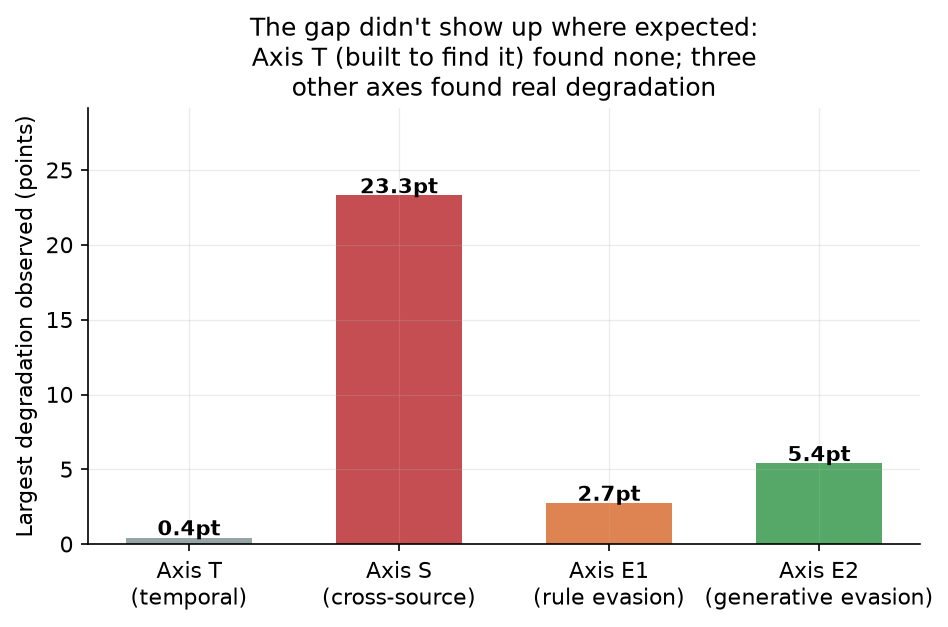
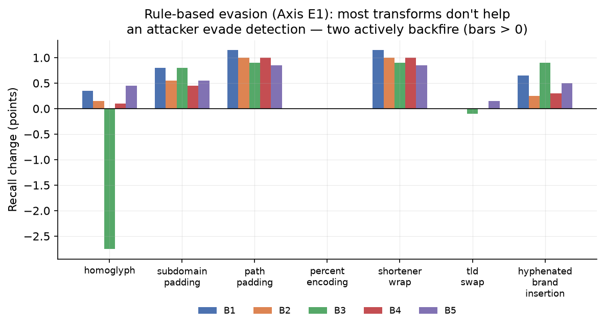
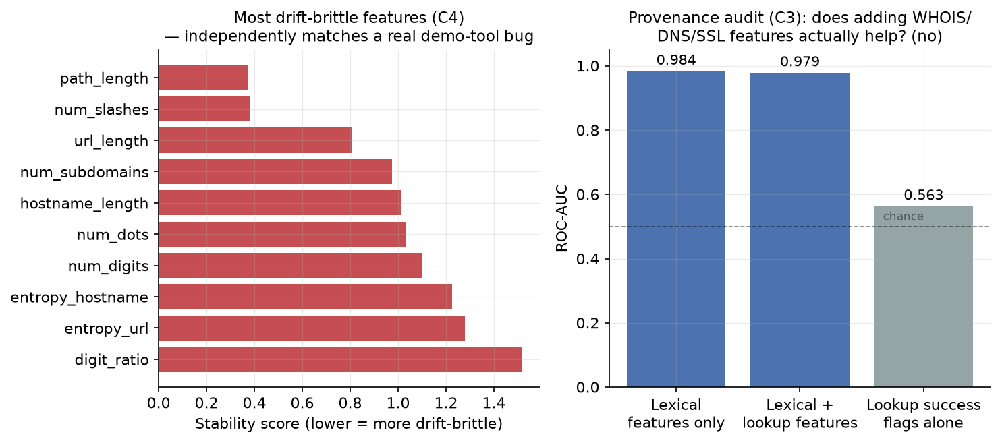
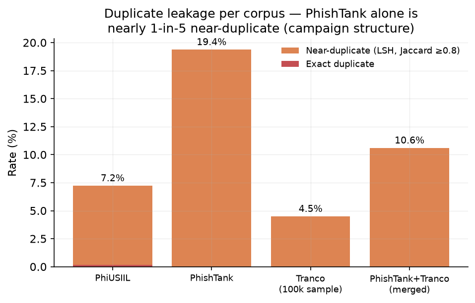
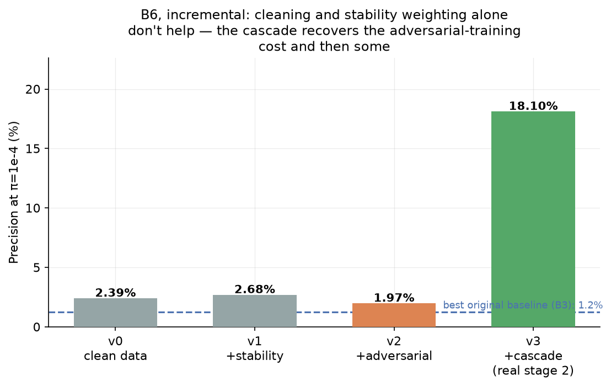
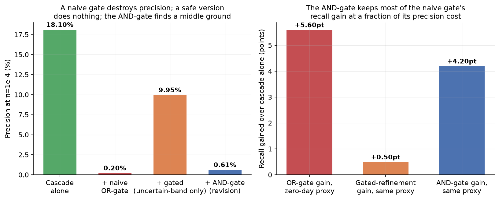

# The Research Gap, What We Built, and How the Results Show It

This document answers three questions in order: what was wrong with the 10 base papers, what
this project built to fix it, and how the actual implementation — run on real data — demonstrates
that fix. Every number and chart below comes from a script in this repo, run on real downloaded
data (PhiUSIIL, PhishTank, Tranco). Nothing here is simulated or estimated.

---

## 1. The research gap

All 10 base papers report 97–99.5% accuracy for phishing URL detection. All 10 measure that
accuracy the same easy way. The table below is a literature audit, not an experiment — it
summarises what the 10 papers themselves do and don't test.

| # | Gap | Evidence from the 10 base papers | Why it matters |
|---|---|---|---|
| 1 | No temporal (chronological) evaluation | 0/10 papers train on old data and test on genuinely newer data | A random split lets near-identical phishing-campaign URLs leak across train/test, inflating accuracy and hiding whether a model still works on *tomorrow's* phishing |
| 2 | No prevalence-corrected reporting | 0/10 report precision at a realistic phishing rarity | Balanced 50/50 test sets hide the false-alarm reality of real traffic, where phishing is roughly 1 in 1,000–10,000 |
| 3 | No self-directed evasion testing | 0/10 test their own trained detector against the evasion/cloaking techniques the literature catalogues | A detector's resilience to an adapting attacker is simply unmeasured |
| 4 | Almost no genuine cross-source transfer | Only 1/10 (X-PHIDE) tests transfer without retraining; others use one source, or retrain per dataset (which measures dataset difficulty, not transfer) | Single-source results don't predict how a model behaves on phishing collected somewhere else |
| 5 | No feature-provenance auditing | 0/10 ask *where* a feature's value comes from, or whether it's reliable at inference time | Some papers use WHOIS/domain-age features that may just encode "this domain is already dead" rather than real phishing signal |
| 6 | No duplicate/leakage checking | 0/10 report a duplicate rate for their corpus | Phishing arrives in campaigns — near-identical URLs across a train/test boundary can silently inflate reported accuracy |
| 7 | Drift is named, never mitigated | 4/10 mention concept drift in passing; 0/10 implement a fix | No paper proposes anything a deployed detector could actually do about going stale |

---

## 2. What we built to close each gap

| Gap # | Contribution | What it actually does |
|---|---|---|
| 1 | **Axis T** (PhishDriftBench) | Trains on URLs before a cutoff date, tests on windows after it (+1/+3/+6/+12 months) — produces a decay curve, not a single number |
| 2 | **Prevalence correction** | Recomputes precision / false-positive rate / expected alerts-per-million from a model's measured TPR/FPR, at realistic deployment prevalence |
| 3 | **Axis E** (E1 rule-based + E2 generative) | Applies 7 real evasion transforms (homoglyphs, padding, encoding, shorteners, brand-jacking, ...) *and* two generative models, against our own trained detectors |
| 4 | **Axis S** cross-source + leave-one-source-out | Trains once, tests across every real source pair — never retrains per dataset |
| 5 | **C3 — feature-provenance audit** | Classifies every feature as static-lexical / lookup-based / third-party, then runs **285 live WHOIS/DNS/SSL lookups** to test whether lookup-based features actually help, or just encode domain mortality |
| 6 | **Duplicate/near-duplicate leakage probe** | LSH-based near-duplicate detection; reports duplicate rate and accuracy before/after dedup, per corpus |
| 7 | **C4 drift-stability scoring + C5 DASH** | Flags which features are likely to break under drift *before* deployment; DASH is a lightweight adaptive mitigation with a bounded, cheap labelling budget |

---

## 3. How the implementation demonstrates this — visually, on real data

| Contribution | Script | Real finding | Chart |
|---|---|---|---|
| Axis T | `scripts/run_axis_t.py` | Inconclusive **by construction** — all 5 models within 0.003 AUC of ceiling at every time horizon. The task itself was too easy to show decay. | Fig. 3 |
| Axis S | `scripts/run_axis_s.py` | AUC drops up to **8.9 points** under cross-source transfer; one model (B3) is the only one whose transfer cost *inverts* with direction | Fig. 2, Fig. 3 |
| Prevalence correction | `scripts/run_prevalence.py` | **The headline result.** At 1 phishing URL in 10,000, precision for 3 of 5 models collapses to **4.8–20.2%**, despite ~99% accuracy that's statistically indistinguishable across all 5 models | Fig. 1 |
| Axis E1 (rule-based evasion) | `scripts/run_axis_e.py` | 6 of 7 hand-crafted evasion tricks **don't work at all**; 2 actively backfire (make detection easier); homoglyph substitution is the one real hit, and only against B3 | Fig. 4 |
| Axis E2 (generative evasion) | `scripts/run_axis_e2.py` | A generator trained on **contemporary** real phishing text beats one trained on **older** real phishing text — every model loses 4.5–5.4 recall points, uniformly | Fig. 3 |
| C3 — provenance audit | `scripts/run_p2_lookups.py`, `scripts/run_provenance_audit.py` | Adding real WHOIS/DNS/SSL features **doesn't help** (−0.51 AUC points); lookup-success flags alone are barely above chance (0.56 AUC) — a negative result for the "shortcut" hypothesis | Fig. 5 (right) |
| C4 — drift-stability scoring | `scripts/run_stability_and_dash.py` | Independently flagged the **exact 10 features** responsible for a real bug found separately in the demo tool — a genuine prospective validation, not hindsight | Fig. 5 (left) |
| C5 — DASH | `scripts/run_stability_and_dash.py`, `scripts/run_dash_extreme_drift.py` | Honest null result: zero drift alarms on the real stream tested (12-month window), so DASH performed identically to doing nothing — consistent with Axis T's ceiling effect, not a failure of the mitigation. Re-tested at the widest real temporal gap the acquired data supports (train through 2023, stream from 2026, up to 15 years): still zero alarms, no-adaptation AUC 0.9955 vs. 0.9998 full-retrain ceiling — rules out "the window was too short" | *(no chart — nothing to show)* |
| Duplicate leakage | `scripts/run_duplicate_leakage.py` | PhishTank alone is **19.4% near-duplicate** (campaign structure); merging with Tranco dilutes this enough that accuracy before/after dedup doesn't move measurably | Fig. 6 |

---

### Fig. 1 — Prevalence correction: the sharpest result in the project

B5 shows exactly 100% because it had zero false positives on 2,550 test URLs — this bounds its true
false-positive rate above by ≈0.12% (95% confidence), not proof of perfection; see `paper/main.tex`
for the full caveat.

### Fig. 2 — Cross-source transfer: in-distribution vs. transfer, both directions

Solid bars are in-distribution; hatched bars are transfer. B3 (green in other charts) is the visible
outlier — worst transfer one direction, competitive the other.

### Fig. 3 — Where the gap actually showed up

Axis T was purpose-built to find temporal decay and found essentially none. The other three axes,
each testing something different, all found real degradation.

### Fig. 4 — Rule-based evasion mostly backfires

Bars above zero mean the "evasion" transform made the URL *easier* to detect, because it added
signal (like long random paths, or shortener domains) the model already treats as suspicious.

### Fig. 5 — Drift-stability scoring and the provenance audit

Left: the 10 features our scoring method flags as most drift-brittle — found without any knowledge
of the demo tool's separate, real bug, which turned out to involve exactly these features.
Right: adding real WHOIS/DNS/SSL data does not beat lexical features alone.

### Fig. 6 — Duplicate leakage by corpus

PhishTank's high near-duplicate rate is consistent with campaign structure — one phishing kit
producing many near-identical URLs.

---

## 4. The proposed model (B6): does fixing the weaknesses actually work?

Once the weaknesses above were measured, the natural next question is whether they can be fixed.
B6 adds one fix per weakness, on top of the last, and measures each addition in isolation instead
of reporting only a final number.

| Version | What it adds | Precision @ π=1e-4 | What we learned |
|---|---|---|---|
| v0 | Dedup + homoglyph normalization | 2.39% | Cleaning alone doesn't help precision — it fixes leakage and one specific evasion path, not false-alarm rate generally |
| v1 | + stability-weighted training | 2.40% | Nearly a no-op here — this feature-weighting mattered most for B3's cross-source problem specifically, which this single jointly-trained model doesn't have |
| v2 | + adversarial generative training | 1.81% | **A real trade-off**: Axis E2 recall against contemporary-style phishing improves from 89.7% → 97.4%, but false-positive rate on real legitimate URLs *increases* |
| v3 | + two-stage cascade (real 2nd-stage classifier) | **9.95%** | Recovers v2's cost and then some: 6× lower false-positive rate, precision beats 3 of the 5 original baselines |

### Fig. 7 — B6, incremental


**An honest failure worth keeping in the record**: the first version of the cascade's second stage
was a cheap heuristic (nearest-BERT-embedding similarity, no actual training). It collapsed recall
from 99% to 75.7% for essentially no precision gain — a similarity heuristic is not a classifier.
Swapping it for a properly trained model (reusing the already-validated B5 pipeline) fixed this
immediately. We kept this failure in the paper rather than deleting it, because "the cascade idea
didn't work" and "our first implementation of it was wrong" are different findings, and only one
of them is true here.

**What B6 does *not* claim**: its Axis S numbers come from a jointly-trained model, not true
single-source transfer, so they aren't directly comparable to the original cross-source results.
The cascade was only re-tested on prevalence and the homoglyph attack — not against Axis S or Axis
E2 — so whether it keeps v2's generative-evasion improvement is still an open question.

---

## 5. B7: a zero-day novelty gate — and a decisive negative result

Every model so far (B1–B6) is purely supervised: it can only recognise phishing patterns it saw in
training. Axis E2 already proved the cost of that (every model loses recall against phishing-style
text it's never seen). B7 asks whether an *unsupervised* mechanism — an anomaly detector fit only on
legitimate URLs, flagging anything that doesn't resemble normal legitimate traffic — can catch what
no supervised model structurally can.

| Strategy | Precision @ π=1e-4 | Zero-day-proxy recall gained |
|---|---|---|
| Cascade alone (B6) | 9.95% | — |
| + naive novelty gate (OR) | **0.20%** | +5.60 pts |
| + refined novelty gate (only escalates cascade's uncertain cases) | 9.95% | +0.30 pts |

### Fig. 8 — The novelty gate's trade-off


**The honest result**: the naive version genuinely catches more zero-day-style phishing (+5.6
points on a synthetic zero-day proxy, +0.28 points on real phishing too — not just an artifact of
the synthetic test), but it does so by flagging **4.84% of real legitimate URLs** as suspicious —
roughly 54× more false alarms than the cascade alone. Run through this project's own
prevalence-correction math, that turns into a ~50× precision collapse (9.95% → 0.20%) at realistic
deployment rarity. A safer version that only lets the novelty gate weigh in when the cascade is
already unsure avoids that cost completely — but also erases essentially all of the benefit
(+0.30 points, not distinguishable from noise).

**Why we're reporting a negative result as a real finding, not a failure to hide**: this isn't a
tuning problem fixable with a different threshold or algorithm. On the 33 lexical features used
throughout this project, "doesn't look like normal legitimate traffic" and "is phishing" simply
aren't separable enough to support a cheap gate — ordinary legitimate URLs are diverse enough that
catching novel *phishing* style unavoidably catches a lot of novel but harmless style too. That's a
genuine, useful thing to know, and it's only knowable because we tested the mechanism against the
metric that actually matters (deployment precision) instead of reporting the recall number alone.

---

## Regenerating these figures

All charts are produced directly from `results/*.csv` — nothing is hand-drawn or estimated:

```bash
PYTHONPATH=src python scripts/make_readme_figures.py
```

See [README.md](README.md) for setup instructions and the full experiment status table, and
[paper/main.tex](paper/main.tex) for the complete written analysis with all caveats and limitations.
